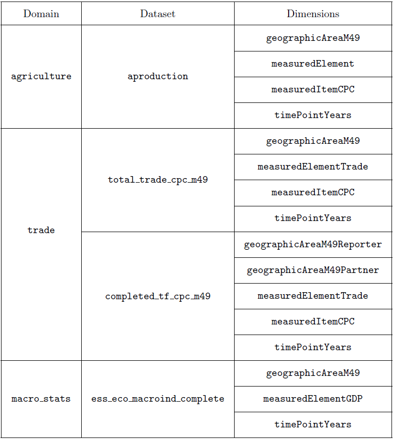
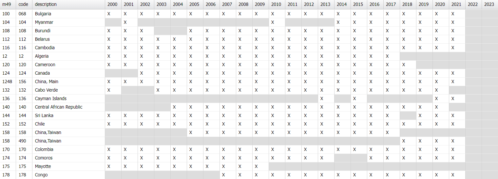
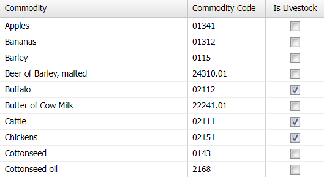
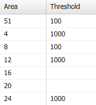
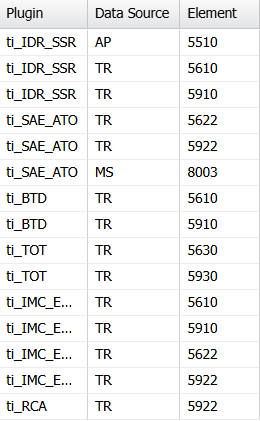

# Input data {#inputdata}

This section provides an exhaustive description of input data and other type of input information needed for the plugins.

## Dimensions and codelists

The dimensions of the input datasets can be all related to the following four: areas, elements, items, and years. For each of them, a brief explanation of the codelists used and some further specifications are provided.

**Areas.** Areas are defined using the `geographicAreaM49` codelist. Additionally, the set of areas considered is limited to reporter countries only; see Section \@ref(reporters) for further detail.

**Elements.** The plugins for this process use many different input elements that are defined either in the `measuredElement` or in the `measuredElementTrade` codelists. A comprehensive description of all the input elements may be found in Section \@ref(inputelements).

**Items.** Items are defined following the `measuredItemCPC` codelist. Additionally, the set of items considered is limited to key commodities (see Section \@ref(keycommodities) for details), along with aggregates F1881 (*Total Merchandise Trade*) and F1882 (*Agricult.Products,Total*), which are used for indicators 3, 5, and 9 only.

**Years.** Computations are performed for the time span defined by the reporter countries datatable (see Section \@ref(reporters) for details), which starts from 2000 and is continuously updated. At the time of writing, the most recent available year is 2022. 

## Domains and datasets

Plugins incorporate a parameter that enables users to select the domain from which they wish to retrieve the input data: either from `disseminated`, which is the Disseminated Datasets domain, or from the specialized ones. 

Table \@ref(fig:domains) provides the list of specialized domains and datasets considered for this process, along with the dimensions for each dataset.

{width=60%}

If users choose to get data from the Disseminated Datasets domain, the following datasets are used as substitutes for those listed in Table \@ref(fig:domains):\
- `aproduction_validated` instead of `aproduction`.\
- `trade_crops_livestock_disseminated` instead of `total_trade_cpc_m49`.

Since `completed_tf_cpc_m49` and `ess_eco_macroind_complete` do not have equivalent datasets in `disseminated`, the plugins use these two regardless of whether the Disseminated Datasets domain is selected or not. This might change in the future if the two datasets become available in the `disseminated` domain.

## Datatables

The plugins for this process heavily rely on auxiliary information stored in three SWS datatables. This section is dedicated to their description.

### Reporter countries {#reporters}

The reporter countries datatable is used in all plugins to select which countries should be included in the computation of the indicators.

The key information to identify the datatable is the following:\
- Domain id: `trade-reports`.\
- Datatable id: `reporters_by_year_trade_indicators`.

As depicted in Figure \@ref(fig:reporters), the datatable has many columns:\
- `m49`, which contains the country's m49 code.\
- `code`, which specifies the country's code using various standards -- this column is ignored for this process.\
- `description`, which provides the country's description.\
- Other $31$ columns, labeled from `year_2000` to `year_2030`, which indicate whether the country has been a reporter country or not in the corresponding year.

The datatable is used to select the countries for which the indicators are to be computed. In the columns referred to years, the datatable contains `X` whenever the corresponding country is a reporter country in that year; otherwise, the cell is empty. At the time of writing, columns for years from $2023$ to $2030$ are empty, implying that calculations should be made only for years ranging from $2000$ to $2022$.

The column `code` is included in the datatable for other purposes, and is disregarded for this process. There are $5$ countries that have two distinct `code`s for different years, yet maintain a unique `m49` code across all years. The current `description` of these countries is: *China,Taiwan*, *Croatia*, *Eswatini*, *North Macedonia*, *United Kingdom*. In such cases, the resulting two rows referring to the same country are merged, preserving the `X`'s from both rows (which originally did not overlap).

While the number of reporter countries may vary for different years, the total number of countries encompassed in the datatable is $198$.

### Key commodities {#keycommodities}

The key commodities datatable is used in all plugins to select which commodities should be included in the computation of the indicators.

The key information to identify the datatable is the following:\
- Domain id: `trade-reference-files`.\
- Datatable id: `key_commodities_codes`.

As depicted in Figure \@ref(fig:commodities), the datatable has three columns:\
- `commodity`, which contains the commodity's description.\
- `commodity_code`, which specifies the commodity's CPC code.\
- `livestock`, which is a binary value denoting if the commodity is livestock or not.

The number of key commodities included in the datatable is $54$. The plugins exclusively use the `commodity_code` column.

### Thresholds

The thresholds datatable is used for indicators $7$ and $8$ to count the total number of importing and exporting countries for a given commodity $i$, respectively.

The key information to identify the datatable is the following:\
- Domain id: `trade-reference-files`.\
- Datatable id: `trade_outlier_country_thresholds`.

As depicted in Figure \@ref(fig:thresholds), the datatable has two columns:\
- `area`, which contains the area's m49 code.\
- `threshold`, which gives the corresponding threshold expressed in tonnes.

The datatable exclusively includes countries. Each country has its own threshold value that is applied to all commodities. The total number of importing and exporting countries for a given commodity $i$ only consider countries whose import or export quantities, respectively, exceed the threshold for that country.

If a country lacks a corresponding threshold entry in the datatable, a conventional threshold value of $1000$ is applied.

### Input elements {#inputelements}

The input elements datatable is used in all plugins to avoid hardcoding the input elements.

The key information to identify the datatable is the following:\
- Domain id: `trade-reference-files`.\
- Datatable id: `ti_input_elements`.

As depicted in Figure \@ref(fig:inputelements), the datatable has three columns:\
- `plugin`, which denotes the involved plugin.\
- `data_source`, which specifies the data sources for each plugin.\
- `element`, which includes the input element(s) for each data source and each plugin.

Each plugin reads the datatable, focuses on its own rows, and retrieves all input elements for each data source.
