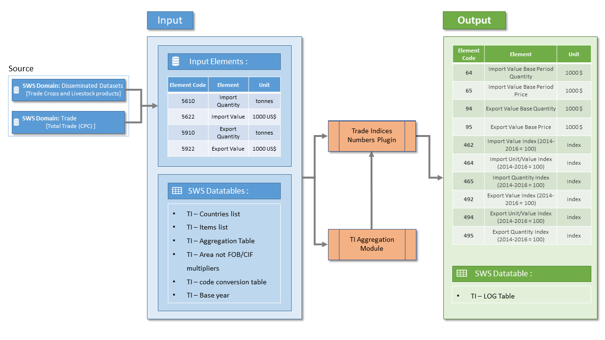
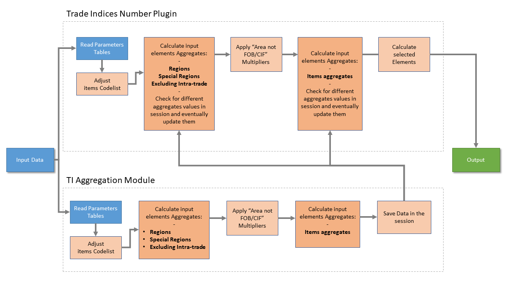
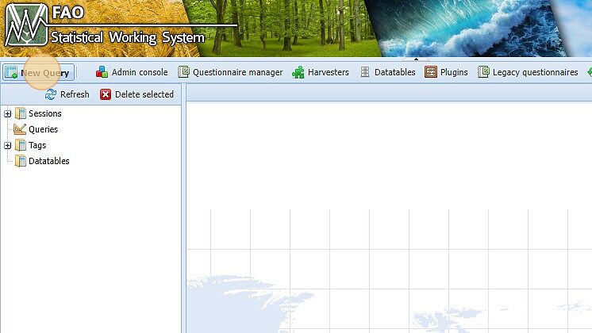
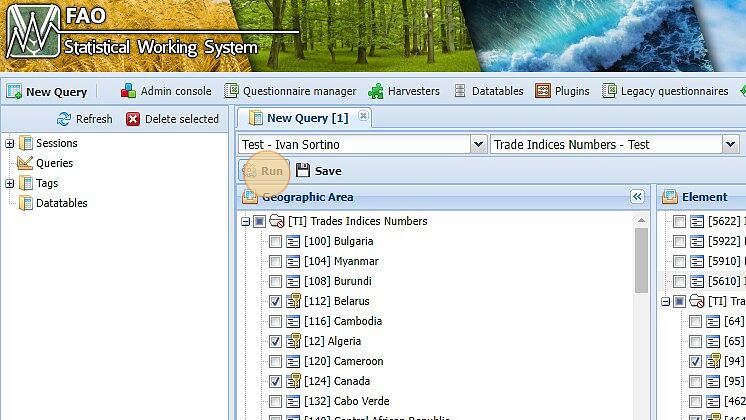
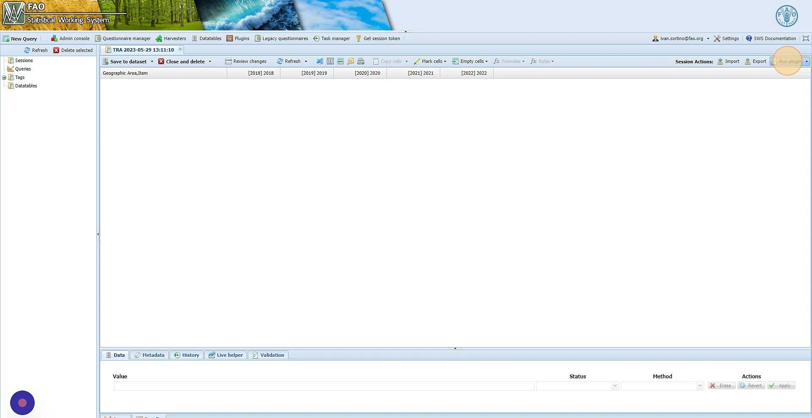
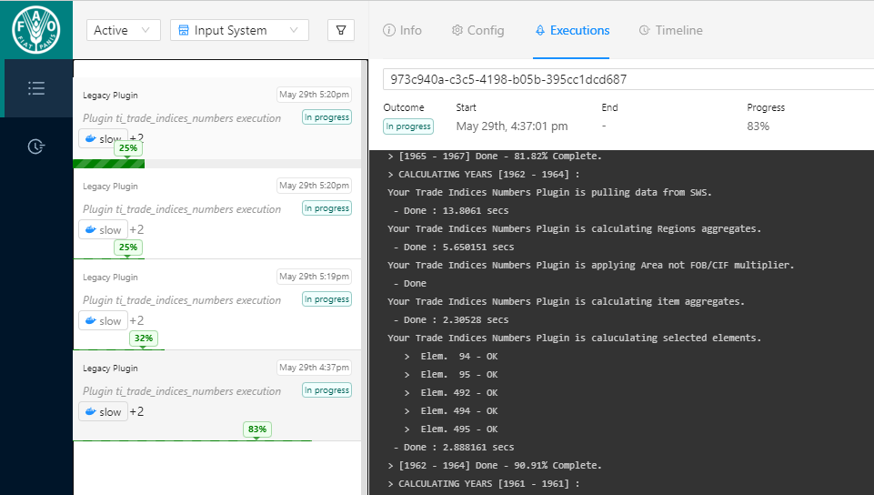

# Trad Indices Numbers - Plugin

The general data flow of the plugin can be summarized as in picture \@ref(fig:gendatflow) below :

The plugin requires the following input data: Import/Export Quantity (Elem. 5610/5910) and Import/Export Value (Elem. 5622/5922). You can choose the source of the data by specifying the source parameter in the plugin. The options include fetching the data from the 'Disseminated Datasets' Domain or the 'Trade' Domain. It is highly recommended to refer to the first source option during the validation procedure to ensure a better match with the existing FAOSTAT values.\
To accurately parameterize the calculation, the plugin will read various support data tables described later in section \@ref(supportdt).\
Subsequently, the input data will be passed to the Trade Indices plugin to calculate the various desired elements.\
Before launching the Trade Indices Plugin, it is also possible to run the "TI Aggregation module" for calculating aggregated items and regional aggregates, checking their values, and potentially modifying them. These modified aggregates will then be automatically ingested by the Trade Indices Plugin.\
Note that both modules are parameterized by the same support data table.\
The output of the plugin will consist of the selected elements, and additionally, an informative log row will be added to the `TI - Log` datatable.

## Support Datatables {#supportdt}

The Trade Indices Numbers calculation can be finely tuned modifying the following support datatables. Here a description of their usage. 

  * `TI - Country List` : contains the list of countries for which the plugin will calculate the Trade Indices, does not contains regions of aggregates;
  
  * `TI - Item List` : contains the list of items for which the plugin will calculate the Trade Indices, does not contains aggregates; 
  
  * `TI - Aggregation table` : Group composition for both regional, special regions and items aggregates. The composition as been aligned with the one currently used on the _Trade Crops and Livestock_ (TCL) Domain;
  
  * `TI - Area not FOB/CIF multipliers` : define the countries to which the FOB/CIF multiplier is applied, it is also possible to select the start and end year for which this multiplier is applied;
  
  * `TI - code converstion table` : map the correct CPC codes used in the `TI - Item List` table with the incorrect codes used in SWS that currently contain the input data needed;
  
  * `TI - Base year` : allows the user to select the base year for the calculations. The base period is calculated as the three year mean around the selected base year. 
\
Note that both _Trade Indices Plugin_ and _Ti - Aggregation module_ will perform the calculation based on the same supporting datatables.

## Plugin Workflow

A more detailed workflow of the plugin is reported in figure \@ref(fig:workflow).
The Plugin works within a session, meaning that before running the plugin you will need to select in the query the countries, elements, items, and years that you want the Plugin to compute.

The workflow can be summarized as follow:

  1. The plugin read all its parameter, supporting datatables and selected query;
  
  2. It adjust the codelist according to `TI - code converstion table` in order to successfully pull data from SWS;
  
  3. Calculate, for input elements, aggregates values for *Regions, Special Regions, Excluding Intra-trade* according to `TI - Aggregation table`. It also check if some of the calculated values are already in the session and eventually update them if they differ;
  
  4. Apply FOB/CIF multipliers for the years specified in `TI - Area not FOB/CIF multipliers`;
  
  5. Calculate, for input elements, aggregates values for *Items aggregates* according to `TI - Aggregation table`. It also check if some of the calculated values are already in the session and eventually update them if they differ;
  
  6. Apply the methodology described in section \@ref(methodology);
  
  7. Save data in the session;
  
  8. Update `TI - Log Table` .
  
### TI - Aggregation Module

The TI - Aggregation Module is and optional Plugin which scope is to calculate and save in the session all the different aggregates ingested by the Trade Indices Plugin. \
The user is then able to run the plugin and check inside the session all the aggregates values computed for the input elements. \
It is possible then to modify the values manually if the technical unit may need it. 
*The Trade Indices Plugin will compare the aggregates stored in the session and automatically incorporate any modifications made into the subsequent calculations.*

## Parameters 

The Trade Indices Plugin requires the following parameters, mandatory parameters are marked in bold:

  - **SOURCE - Input DATA** :  mandatory parameter, allow to select if to pull data from `Trade` Domain or `Disseminated Dataset` Domain;
  
  - *Output* : Optional parameter, allow the user to select to seva in the session the results for all the items and countries specified in the parameter tables or just those selected in the query;
  
  - *Import/Export Filter* : Optional parameter, filter the calculation only for Import Elements (64, 65, 462, 464, 465) or Export Element (94, 95, 492, 494, 495);
  
  - *Year range Filter* : Optional parameter, allow to pass a range of year to perform the calculations. The range have to be in format YYYY-YYYY.
 

The Filter parameters have been introduced to divide the calculation load among multiple tasks. It is highly recommended to use these parameters when dealing with a year range greater than twenty years. This is because the number of data points returned during the calculation exceeds the available memory in the task manager. By applying appropriate filters you can distribute the workload across multiple tasks, enabling faster and more efficient execution of the calculations. \

## Additional Notes

Please note that due to recent adjustments made in the methodology to align the calculations with TCL Domain practices, there may be some differences between the final results obtained using the Trade Indices Plugin and the data disseminated on FAOSTAT. These adjustments are aimed at improving the accuracy and consistency of the calculations. Therefore, it is important to consider this information when comparing the results generated by the plugin with the data available on FAOSTAT.\
For instance the plugin do not perform an intermediate aggregation of single items in order to group them under similar commodities. \
\
Some additional information about the CPC codes converted internally by the Plugin according to `TI - code converstion table` :\

* _'Beet Pulp'_ item is saved under CPC code 39149.01 in FAOSTAT and code 39140.01 in SWS _('Beet Pulp')_
* _'Fine animal hair, n.e.c.'_ is saved under CPC code 02943.90 in FAOSTAT and code 02943.02 in SWS _('Fine hair, n.e.')_
* _'Juice of fruits n.e.c.'_ is saved under CPC code 21439.90 in FAOSTAT and code  in SWS _('Juice of fruits n.e.')_
* _'Rice, paddy (rice milled equivalent)'_ is saved under CPC code F0030 in FAOSTAT and code 23161.02 in SWS _('Rice, Milled')_

All the items mentioned above will be pulled from SWS with their corresponding CPC codes. However, when saving the results, they will be stored with the correct CPC codes used for dissemination purposes. This ensures that the data is aligned with the standardized coding system and can be easily compared and referenced with other datasets.

## Execution 

Please note that the Trade Indices Plugin is not a core plugin and runs within a session. Before running the plugin, it is mandatory to create a session inside the "Trade Indices Numbers" Dataset of the "Trade" Domain. In this session, you need to specify the desired elements and years that you are interested in. This step ensures that the plugin operates on the relevant data and produces accurate results based on your specific requirements.

  1. Go to the Statistical Working system and select a new query:

   
  
  2. Select `Trade` Domain and `Trade Indices Numbers` dataset : 
  3. Select the desired Items, Elements, Countries, and Years then run the query : 
  

   

  4. Go to run plugin and select _Trade Indices Numbers_ Plugin
  5. Select the source Domain through the _SOURCE - Input_ Parameter
  6. Select _ Run Docker Slow_ to run the plugin 
  

 

  7. Check the Task status in the Task Manager. 
  
  
  

  
