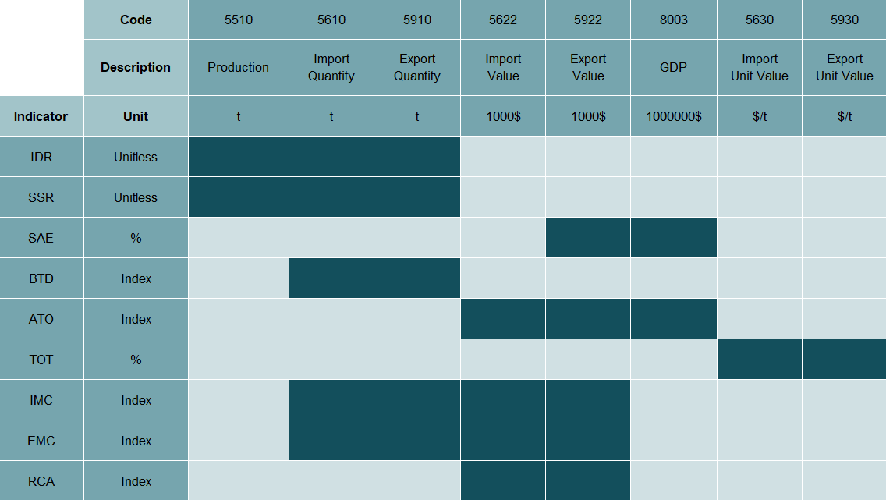

# Input and output elements {#elements}

The plugins for this process use many different input elements. For this reason, they are separately described here, together with the output elements they help computing.

## Input elements {#inputelements}

The input elements considered for this process are listed in Table \@ref(tab:input), which also specifies the fundamental quantities they are used for. When working with specialized domains, the following datasets can be used to obtain the elements:\
- `aproduction`: $5510$.\
- `total_trade_cpc_m49`: $5610$, $5910$, $5622$, $5922$, $5630$, $5930$.\
- `completed_tf_cpc_m49`: $5610$, $5910$.\
- `ess_eco_macroind_complete`: $8003$.

Elements $5610$ and $5910$ are retrieved either from dataset `total_trade_cpc_m49` or from dataset `completed_tf_cpc_m49`, depending whether the focus is on unilateral or bilateral trade exchanges, respectively.

   **Code**    **Description**     **Unit**                           **Used to compute**
  ---------- ------------------- ------------- -----------------------------------------------------------------
     5510        Production           $t$                                 $Y^q_{ij}$
     5610      Import Quantity        $t$                             $M^q_{ij}$, $M^v_{i[AB]}$, $N^M_i$
     5910      Export Quantity        $t$                             $X^q_{ij}$, $X^v_{i[AB]}$, $N^X_i$
     5622       Import Value       $1000\$$                           $M^v_{ij}$, $^{\text{agr}}M^v_{j}$
     5922       Export Value       $1000\$$                           $X^v_{ij}$, $^{\text{agr}}X^v_{j}$
     5630     Import Unit Value     $\$/t$                          $\text{UVI}^M_{ij, t}$
     5930     Export Unit Value     $\$/t$                          $\text{UVI}^X_{ij, t}$
     8003            GDP          $1000000\$$                           $\text{GDP}_j$
     
: (#tab:input) Input elements, and fundamental quantities they are used to compute.

## From input to output elements

Once the input elements listed Table \@ref(tab:input) are retrieved, they can be used to compute the fundamental quantities presented in Table 2.1. These quantities, in turn, serve as the basis for calculating the indicators. Figure \@ref(fig:inputoutput) provides a concise overview of this two-step process, clearly indicating which input elements are used in the computation of each indicator.

## Output elements

The process required the introduction of $9$ new elements and $6$ new subelements into `measuredElementTrade` codelist. They are listed in Table \@ref(tab:output).

Each of the $9$ elements correspond to a different indicator. The BTD indicator has two different forms -- for when the reporter country acts either as an importing or as an exporting country -- so two subelements are created: $504.01$ and $504.02$, respectively. The other two subelements of element $504$, which are $504.\text{d}1$ and $504.\text{d}2,$ are used to (possibly) include the corresponding differences between imports and exports; they are computed as the numerator of Equation (2.4) and Equation (2.5), respectively. Finally, since RCA is calculated for each commodity for both the agricultural aggregates F1881 and F1882, subelements $509.01$ (for aggregate F1881) and $509.02$ (for aggregate F1882) are also introduced.
  
    **Code**                      **Description**                    **Unit**  
  -----------------  -------------------------------------------  ----------- 
    $501$                      Import Dependency Ratio             Index    
    $502$                       Self-Sufficiency Ratio             Index    
    $503$              Share of Agricultural Exports to GDP        $\%$    
    $504$                Bilateral Trade Discrepancy index         Index
    $504.01$           BTD index - Importing reporter country      Index
    $504.\text{d}1$  BT difference - Importing reporter country    $1000\$$ 
    $504.02$           BTD index - Exporting reporter country      Index
    $504.\text{d}2$  BT difference - Exporting reporter country    $1000\$$ 
    $505$                 Agricultural Trade Openness index        Index    
    $506$                       Terms of Trade index               $\%$    
    $507$                 Import Market Concentration index        Index    
    $508$                 Export Market Concentration index        Index    
    $509$               Revealed Comparative Advantage index       Index  
    $509.01$                RCA index - F1881 aggregate            Index
    $509.02$                RCA index - F1882 aggregate            Index

: (#tab:output) Output elements.

The output elements are stored within the Trade domain in either one of two datasets: `trade_indicators` and `trade_indicators_bilateral`. Element $504$ and its subelements are accessible within `trade_indicators_bilateral`, while the others can be retrieved in `trade_indicators`. The only difference between the two datasets is that `trade_indicators`'s dimension `geographicAreaM49` is replaced in `trade_indicators_bilateral` with `geographicAreaM49Reporter` and `geographicAreaM49Partner`.
